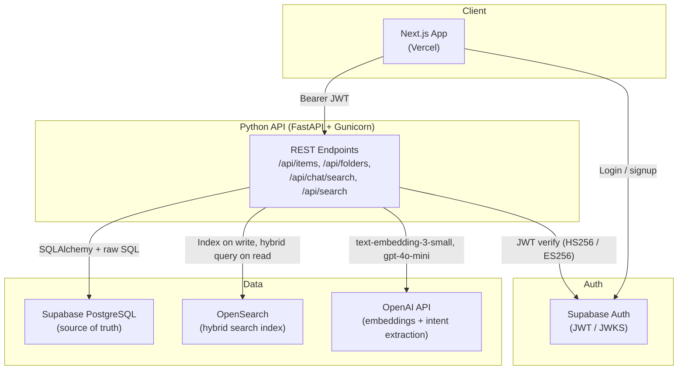

# InventoryGent

**AI-powered inventory management platform with hybrid semantic search.**

[InventoryGent](https://www.inventorygent.com) is a full-stack inventory platform for individuals and small teams who need structured stock tracking plus natural-language search. Users organize items in nested folders, monitor low-stock alerts, and query inventory in plain English — backed by a Python API that combines PostgreSQL for transactional data with OpenSearch for hybrid text + vector search.

---

## Live Demo

**[https://www.inventorygent.com/auth/login](https://www.inventorygent.com/auth/login)**

Create a free account to explore the dashboard, manage items and folders, and try the AI search at `/ai-search`. Ask questions like *"items under $50"*, *"low stock items"*, or *"wireless headphones"* to see hybrid search in action.

---

## Key Features

- **Inventory CRUD** — Create, update, and delete items with SKU, quantity, price, tags, descriptions, and optional image URLs.
- **Hierarchical folders** — Nested folder tree with color coding, item counts (maintained by database triggers), and folder-scoped views.
- **Dashboard & reporting** — Real-time stats: total items, inventory value, low-stock count, folder count, recent activity, and low-stock alerts.
- **AI natural-language search** — Chat-style interface (`/ai-search`) where GPT-4o-mini extracts intent and filters from free-text queries.
- **Hybrid search (OpenSearch)** — Combines fuzzy text match and kNN vector similarity on item descriptions using OpenAI `text-embedding-3-small` embeddings.
- **Structured SQL filters** — SKU, price range, tags, folder, quantity, and low-stock queries run as parameterized PostgreSQL queries.
- **Inventory Q&A** — Ask overview questions ("how many items do I have?", "what's my total value?") without running a search.
- **Authentication** — Email/password signup and login via Supabase Auth; JWT validated on every API request with per-user data isolation.
- **Protected routes** — Next.js middleware enforces session checks; unauthenticated users are redirected to login.

---

## Architecture Overview

The platform follows a **decoupled monolith** pattern: a Next.js frontend handles UI and auth sessions; a containerized FastAPI backend owns all business logic, persistence, search indexing, and LLM orchestration. There are no Next.js API routes or server actions for inventory data — the browser talks directly to the Python API with Supabase bearer tokens.



### Architectural decisions

| Decision | Rationale |
|----------|-----------|
| **PostgreSQL as source of truth** | Relational model fits inventory (folders, items, user scoping). Supabase provides managed Postgres with RLS policies and auth integration. |
| **OpenSearch for semantic search** | Offloads vector + full-text hybrid queries from Postgres. kNN HNSW index on 1536-dim embeddings with a custom hybrid search pipeline (min-max normalization + arithmetic mean). |
| **Write-through indexing** | Items are embedded and indexed in OpenSearch synchronously on create/update; deleted on remove. Keeps search consistent without a separate queue. |
| **LLM as query planner, not data store** | GPT-4o-mini parses natural language into structured filters + semantic query strings; all data retrieval runs against Postgres/OpenSearch. |
| **Containerized API for AWS** | Multi-stage Dockerfile with Gunicorn + Uvicorn workers, health checks, and non-root user — ready for ECS/Fargate deployment. |
| **Frontend on Vercel** | Next.js standalone output; static + SSR with Supabase SSR client for session management. |

### Search flow

1. User sends a message to `POST /api/chat/search`.
2. GPT-4o-mini extracts intent (`search_items`, `inventory_question`, or clarify).
3. For structured filters (SKU, price, tags, low stock) → parameterized SQL against Postgres.
4. For semantic queries → embed query text → OpenSearch hybrid search (fuzzy match + kNN) → fetch full item records from Postgres by ID → apply post-filters → return ranked results.

---

## Backend Engineering Highlights

### API design

RESTful endpoints scoped by authenticated user ID (`sub` from JWT). Key routes:

| Method | Endpoint | Purpose |
|--------|----------|---------|
| `GET` | `/health` | Container health check |
| `GET` | `/api/session` | Current user ID and display name |
| `GET/POST/PATCH/DELETE` | `/api/items`, `/api/items/{id}` | Item CRUD |
| `POST` | `/api/items/{id}/embedding` | Re-index item in OpenSearch |
| `GET/POST/PATCH/DELETE` | `/api/folders`, `/api/folders/{id}` | Folder CRUD |
| `GET` | `/api/inventory/summary` | Aggregate stats (totals, value, low stock) |
| `POST` | `/api/search` | Hybrid search with explicit filters |
| `POST` | `/api/chat/search` | Natural-language search with LLM intent extraction |

### Database schema & optimization

- **Normalized schema** — `items` and `folders` tables with UUID PKs, foreign keys to `auth.users`, and `ON DELETE CASCADE`.
- **Indexes** — `user_id`, `folder_id`, `updated_at DESC` on items; `user_id`, `parent_id` on folders.
- **Triggers** — Auto-maintain `folder.item_count` on item insert/update/delete; auto-update `items.updated_at`.
- **Row Level Security** — Supabase RLS policies enforce `auth.uid() = user_id` on all tables.
- **Connection pooling** — SQLAlchemy `QueuePool` (10 connections, 5 overflow, `pool_pre_ping=True`).

### Security

- **JWT validation** — Supports Supabase HS256 (shared secret) and ES256 (JWKS endpoint) algorithms with `audience=authenticated`.
- **Per-request auth** — FastAPI `Depends(authenticate_request)` on every data endpoint; all SQL queries include `user_id` filter.
- **CORS** — Configurable via `CORS_ORIGINS` environment variable.
- **Container hardening** — Non-root `app` user, multi-stage Docker build, no secrets in image layers.
- **Mock auth for local dev** — `ALLOW_MOCK_AUTH=true` bypasses JWT when Supabase is not configured.

### Performance & scalability

- **Hybrid search score threshold** — `HYBRID_SEARCH_MIN_SCORE = 0.05` filters weak vector matches before loading from Postgres.
- **Postgres hydration** — OpenSearch returns IDs + scores only; full item records fetched in a single `ANY(:item_ids)` query.
- **OpenSearch startup resilience** — 30 retry attempts with 2s delay during index/pipeline provisioning.
- **Gunicorn multi-worker** — 2 Uvicorn workers for concurrent request handling in production.

### Testing & CI/CD

No automated test suite or CI/CD pipeline is included in this repository. Linting is available via `npm run lint` in the frontend.

---

## Tech Stack

| Layer | Technologies |
|-------|-------------|
| **Frontend** | Next.js 16 (App Router), React 19, TypeScript, Tailwind CSS 4, Radix UI, Zod, React Hook Form |
| **Backend** | Python 3.11, FastAPI, SQLAlchemy, Pydantic, Gunicorn + Uvicorn |
| **Database** | Supabase PostgreSQL (with RLS, triggers, array tags) |
| **Search** | OpenSearch 2.x (`opensearch-py`) — kNN vectors, hybrid search pipeline |
| **AI** | OpenAI API — `text-embedding-3-small` (embeddings), `gpt-4o-mini` (intent extraction) |
| **Auth** | Supabase Auth — JWT validation via PyJWT (HS256 secret or ES256 JWKS) |
| **Containers** | Docker multi-stage builds for frontend and backend |
| **Analytics** | Vercel Analytics |

---

## Current Infrastructure

The production API runs as a containerized FastAPI service on AWS. Postgres and auth are handled by Supabase; the frontend is deployed on Vercel — see the architectural decisions table above for rationale.

| Service | Role in the platform |
|---------|---------------------|
| **Amazon ECS / Fargate** | Runs the containerized FastAPI API (`backend/Dockerfile`). Gunicorn manages 2 Uvicorn workers with a 120s timeout for LLM/search workloads. |
| **Amazon ECR** | Stores the API container image built via `docker build -t inventory-api ./backend`. |
| **Amazon OpenSearch Service** | Production search index. The API connects via `OPENSEARCH_URL` with optional basic auth (`OPENSEARCH_USERNAME` / `OPENSEARCH_PASSWORD`) and TLS (`OPENSEARCH_VERIFY_CERTS`). Locally, OpenSearch runs as a Docker Compose service. |

---

## Project Structure

```
├── frontend/                    # Next.js 16 application
│   ├── app/                     # App Router pages (dashboard, auth, AI search)
│   ├── components/
│   │   ├── inventory/           # Inventory UI (dashboard, grid, sidebar, forms)
│   │   └── ui/                  # Radix-based design system components
│   ├── lib/                     # API client, types, mappers, hooks
│   ├── utils/supabase/          # Supabase SSR/client/middleware helpers
│   ├── Dockerfile               # Multi-stage production build (standalone output)
│   └── middleware.ts            # Auth session guard
├── backend/                     # FastAPI application
│   ├── main.py                  # API routes, SQL queries, search orchestration
│   ├── auth.py                  # Supabase JWT verification (HS256 + ES256 JWKS)
│   ├── chat_search.py           # LLM intent extraction (GPT-4o-mini)
│   ├── opensearch_hybrid.py     # OpenSearch index, embeddings, hybrid search
│   ├── migrations/              # Supabase SQL migrations (schema + RLS + triggers)
│   ├── Dockerfile               # Multi-stage production build (Gunicorn)
│   └── requirements.txt
├── docker-compose.yml           # Local stack: OpenSearch + API + frontend
├── scripts/                     # Repo maintenance scripts
├── SETUP.md                     # Local development and deployment guide
└── SUPABASE_SETUP.md            # Supabase auth configuration guide
```

---

## Local Development & Deployment

See **[SETUP.md](./SETUP.md)** for prerequisites, environment configuration, Docker/local dev commands, linting, and production deployment.
